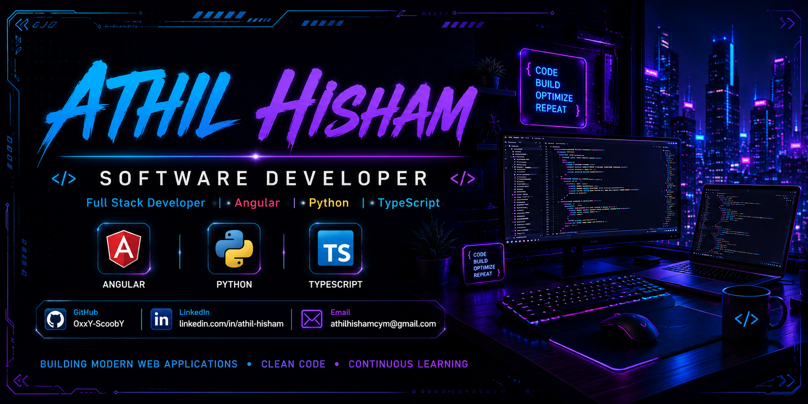

<!-- ====================== Banner ====================== -->

  

<!-- ================= Typing Animation ================= -->

  

<!-- ====================== Heading ===================== -->

<h1 align="center">Hi 👋, I'm Athil Hisham</h1>

<h3 align="center">
Software Developer • Angular Developer • Python Enthusiast
</h3>

Passionate about building modern web applications, solving real-world problems, and continuously learning new technologies.

---

## 🚀 About Me

- 🎓 Computer Science Engineering Graduate
- 💼 Software Developer at **MINTS Global**
- 🌱 Currently learning **Angular**, **Node.js**, and **System Design**
- 💻 Interested in Full Stack Development
- 🚀 Exploring ERP Systems & Modern Web Technologies
- ⚡ I enjoy building clean user interfaces and solving coding challenges

---

## 💻 Tech Stack

  

---

## 📊 GitHub Statistics

  
  

---

## 📈 Contribution Graph

---

## 🏆 GitHub Trophies

  

---

## 🚀 Featured Projects

| Project | Description |
|---------|-------------|
| 🌸 **FlorA** | AI-powered web application |
| 💼 **Portfolio** | Personal portfolio website |
| 🏢 **ERP Projects** | Enterprise Resource Planning modules |
| 🌐 **NesT-Web** | Responsive web application |
| 🅰️ **Angular Projects** | Angular practice and learning projects |

---

## 🌐 Connect With Me

---

## 📈 Profile Views

  

---

<h3 align="center">
⭐ Thanks for visiting my profile! ⭐
</h3>
